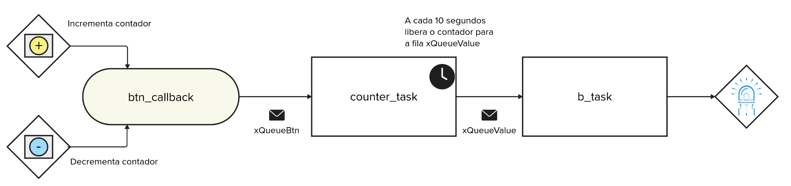

# EXE3

> [!IMPORTANT]  
> Exercício com avaliação manual, não tem teste no wokwi! Mas possui testes de qualidade de código e de rubrica!

Nesse exercício vocês devem criar um firmware que é capaz de a cada 10 segundos permitir que o 
usuário configure um contador (via os botões amarelo e azul), podemos incrementar o contador via o 
botão amarelo e decrementa o contador via o botão azul.

Após os 10 segundos o resultado do valor do contador deve ser transmitido para a `b_task` que fará
o LED azul piscar pelo número de vezes que o contador foi configurado dentro do tempo dos 10segundos.

**O código deve funcionar infinitamente, ou seja, podemos a cada 10s configurar o número de vezes que 
o Led vai piscar**

> Dicas:
> 
> - Use printf para depurar o código

## Detalhes do firmware:

- Utilizar RTOS.
- Seguir estrutura proposta do firmware.
- Botão amarelo incrementa contador
- Botão azul decrementa contador
- Led pisca número de vezes que o contador foi configurado dentro dos 10s
- **printf** pode atrapalhar o tempo de simulação, comenta antes de testar.

## Testes

O código deve passar em todos os testes para ser aceito:

- `embedded_check`
- `firmware_check`
- ~~`wokwi`~~
