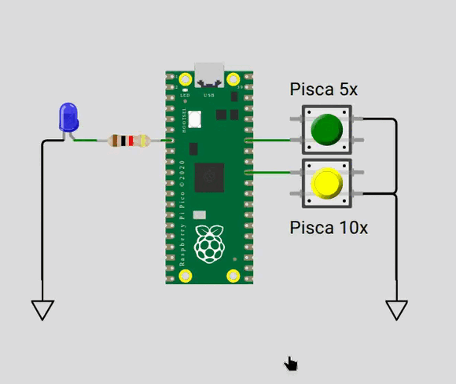
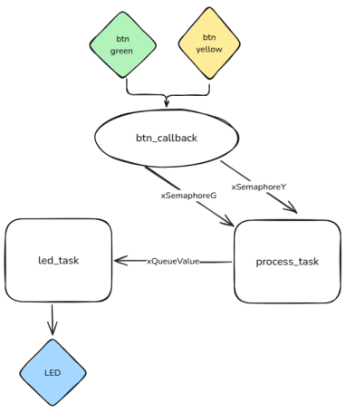

# EXE3

Um sistema que controla o **piscar de um LED** com frequência de `2 Hz`, mas cuja quantidade de piscadas depende do botão pressionado:

* **Botão Verde**: pisca `5 vezes`
* **Botão Amarelo**: pisca `10 vezes`

## RTOS

A implementação deve seguir a estrutura do RTOS representada no diagrama abaixo:

O sistema realiza a leitura dos botões por meio de uma interrupção de PIO.
Quando um botão é pressionado:

* É utilizado o semáforo `xSemaphoreG` para sinalizar à `process_task` que o **botão verde** foi acionado.
* É utilizado o semáforo `xSemaphoreY` para sinalizar  à `process_task` que o **botão amarelo** foi acionado.

A `process_task`, ao identificar qual botão foi pressionado, envia para a fila `xQueueValue` o número correspondente de piscadas (5 ou 10) que o LED deverá executar.

## Detalhes do firmware:

- Utulizar RTOS.
- Seguir estrutura proposta do firmware.
- Você deve possuir no código todos os elementos indicados no diagrama:
    - `btn_callback`
    - `process_task`
    - `led_g_task`
    - `xSemaphoreG`
    - `xSemaphoreY`
    - `xQueueValue`
- **printf** pode atrapalhar o tempo de simulação, comenta antes de testar.

## Testes

O código deve passar em todos os testes para ser aceito:

- `embedded_check`
- `firmware_check`
- `wokwi`

Caso acredite que o seu código está funcionando, porém os testes estão falhando, preencha o formulário:

[Google forms para revisão manual](https://docs.google.com/forms/d/e/1FAIpQLSdikhET4iqFwkOKmgD-G6Ri-2kCdhDLndlFWXdfdcuDfPnYHw/viewform?usp=dialog)