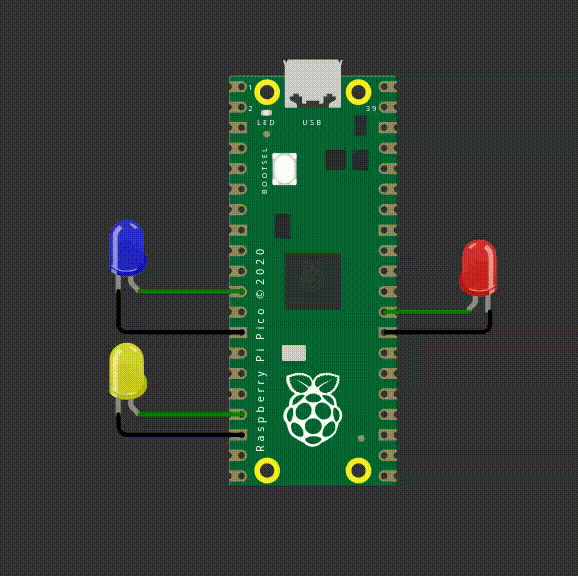
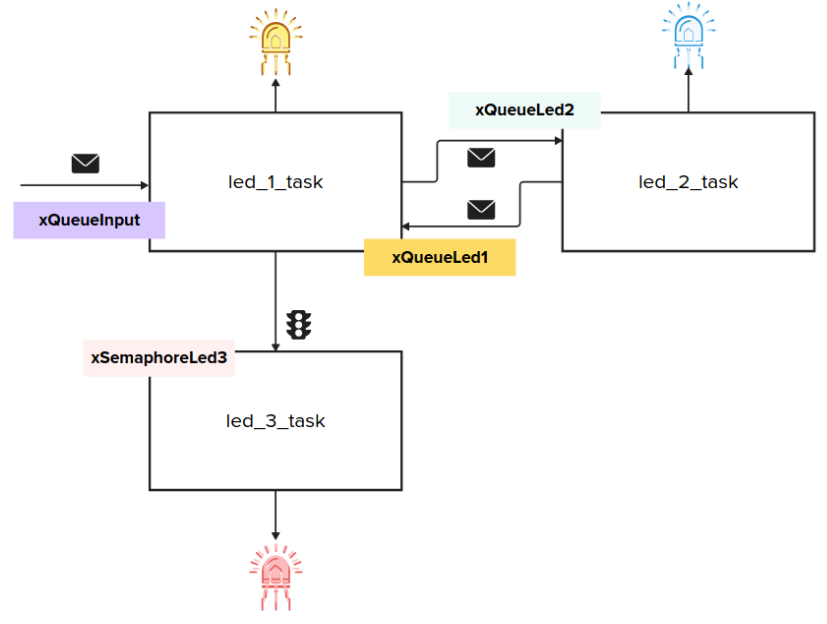
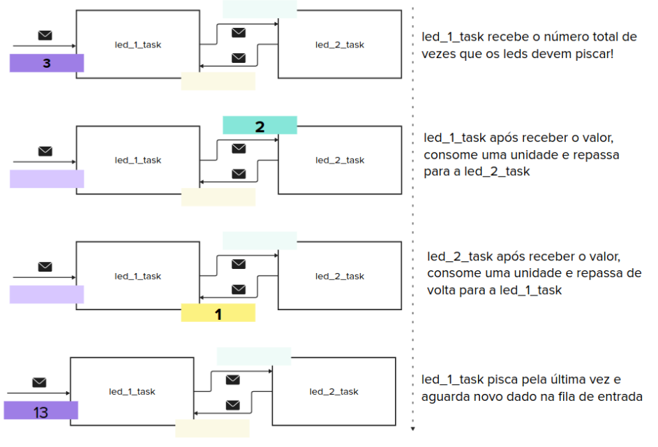

# EXE3

Neste exercício vocês vão utilizar o RTOS para controlarem 3 LEDs: 

- LED Vermelho: Pisca a cada `100ms` sempre que o LED Amarelo estiver piscando
- LED Amarelo: Acende por `500ms` e apaga por `500ms`
- LED Azul: Acende por `500ms` e apaga por `500ms`

Seguindo a lógica a seguir:

Um valor inteiro será enviado na fila `xQueueInput`, esse valor vai definir a soma total de vezes que os LEDs Amarelo E Azul irão piscar. Se esse valor for maior que ZERO a `task_led_1` irá piscar o LED Amarelo uma 
única vez, decrementar o valor recebido e enviar para a `taks_led_2`. A `task_led_2` ao receber esse valor, vai piscar o LED Azul uma única vez, decrementar o valor e enviar para a `task_led_1`. 

**As `tasks` ficam nesse ciclo até consumirem todo o valor que foi enviado inicialmente na `xQueueInput`.**. 

Em paralelo com isso, existe a `task_led_3` que faz o LED Vermelho piscar somente quando a `task_led_1` estiver ativa e piscando o LED Amarelo. A `task_led_3` é controlado pelo seméforo `xSemaphoreLed3`.

**Detalhes de funcionalidade:**

O código fornecido já possui uma fila `xQueueInput` do tipo inteiro e que determina qual o total de vezes que os LEDs amarelo e azul irão piscar. O código também possui uma `input_task` que alimenta essa fila. Vocês não devem se preocupar em colocar dados da fila, apenas tirar!

Vocês devem criar três tasks de acordo com o diagrama apresentando anteriormente e detalhado a seguir:

- `led_1_task`: Faz a leitura da `xQueueInput`, faz o LED Amarelo piscar e ativa/desativa a `task_led_3`. 
- `led_2_task`: Task que faz o LED Azul piscar, consume o contador e devolve para a `task_led_1`.
- `led_3_task`: Task que faz o LED Vermelho piscar, é controlada pelo semáforo `xSemaphoreLed3`.

- `xQueueLed1`: Comunicação entre a `task_led_2`e a `task_led_1`
- `xQueueLed2`: Comunicação entre a `task_led_1`e a `task_led_2`
- `xSemaphoreLed3`: Semáforo que garante que o LED Vermelho só vai piscar quando a `task_led_1` estiver ativa.

A seguir um detalhe do fluxo entre a troca de dados das `tasks_led_1` e `tasks_led_2`:

**Detalhes do firmware:**

- Utulizar RTOS.
- Seguir estrutura proposta do firmware.
- Utilizar período de 500 ms para piscar os LEDs Amarelo e Azul.
- Utilizar período de 100 ms para piscar os LEDs Vermelho.
- **printf** pode atrapalhar o tempo de simulação, comenta antes de testar.

## Testes

O código deve passar em todos os testes para ser aceito:

- `embedded_check`
- `firmware_check`
- `wokwi`

Caso acredite que o seu código está funcionando, porém os testes estão falhando, preencha o formulário:

[Google forms para revisão manual](https://docs.google.com/forms/d/e/1FAIpQLSdikhET4iqFwkOKmgD-G6Ri-2kCdhDLndlFWXdfdcuDfPnYHw/viewform?usp=dialog)
