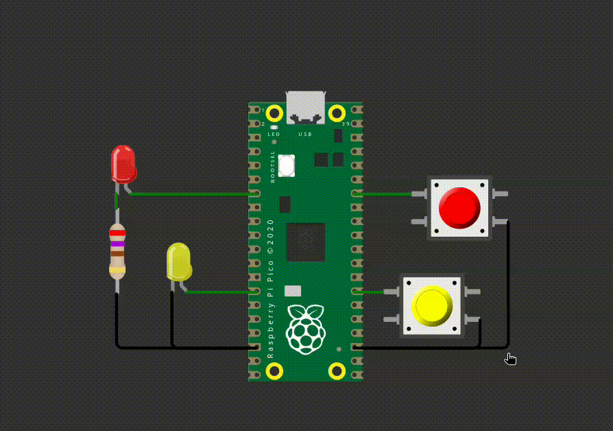

# EXE3

Neste exercício vocês vão utilizar o RTOS para fazer dois LEDs piscarem. Os leds comecam piscar quando o respectivo botão for apertado e param de piscar quando outro botão for apertado.

**Detalhes de funcionalidade:**

- Ao apertar o botão verde referente ao led Azul, o LED azul comeca piscar (50 ms de período).
- Ao apertar o botão azul , o LED azul para de piscar.

- Ao apertar o botão verde referente ao led Amarelo, o LED Amarelo comeca piscar (50 ms de período).
- Ao apertar o botão amarelo , o LED amarelo para de piscar.

**Detalhes do firmware:**

- Utulizar RTOS.
- Seguir estrutura proposta do firmware.
- Utilizar período de 50 ms para piscar os LEDs.
- Deve trabalhar com interrupções nos botões.  
- Não é permitido usar:
    - `sleep_ms(), sleep_us()`.
    - Qualquer variável global que não recursos do RTOS (fila e semáforo)
- **printf** pode atrapalhar o tempo de simulação, comenta antes de testar.